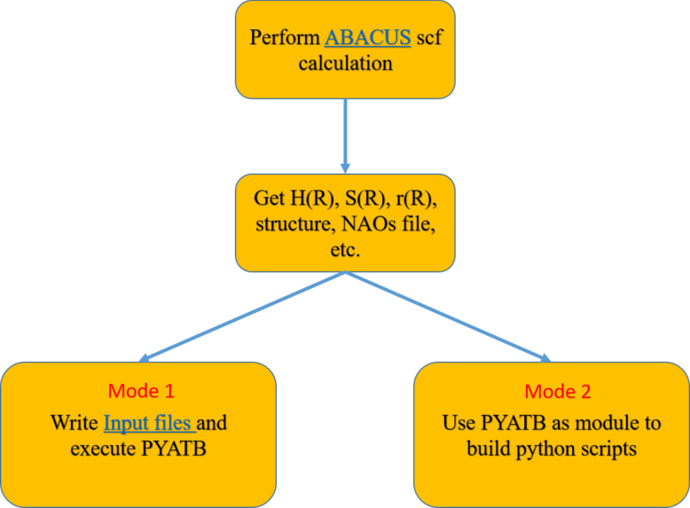

# Installation

## Download

The latest version of the PYATB package can be obtained from the github repository:

```shell
git clone https://git.ustc.edu.cn/tight-binding-module-developers/pyatb.git
```

## Prerequisites

At present, PYATB is running in the Linux system, and the Win system and Mac system have not been tested. In order to use PYATB properly, you need to install the following prerequisites:

- Python 3.7 or newer
- NumPy
- SciPy
- mpi4py
- Matplotlib
- C++ compiler
- BLAS, LAPACK

## install

You can install it with the following simple command:

```shell
python setup.py install --record log
```

The corresponding uninstall operation is to delete the files generated during Python installation. A simple uninstall command is as follows:

```shell
cat log | xargs rm -rf
```


# Introduction

PYATB is an open-source software package for calculating the electronic structure of materials based on the first-principles tightbinding model. 

## Capabilities

PYATB provides the following functionalities:

- related to energy band
  1. band structure
  2. band unfolding
  3. fermi energy
  4. fermi surface
  5. find nodes
  6. JDOS
  7. PDOS
  8. spin texture

- related to band geometry
  1.  AHC
  2. Berry curvature
  3. Berry curvature dipole
  4. Chern number
  5. chirality
  6. CPGE
  7. optical conductivity
  8. polarization
  9. shift current
  10. wilson loop

## workflow




